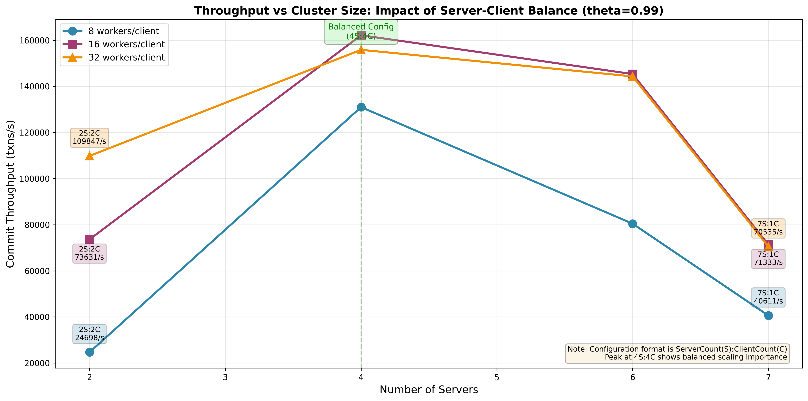
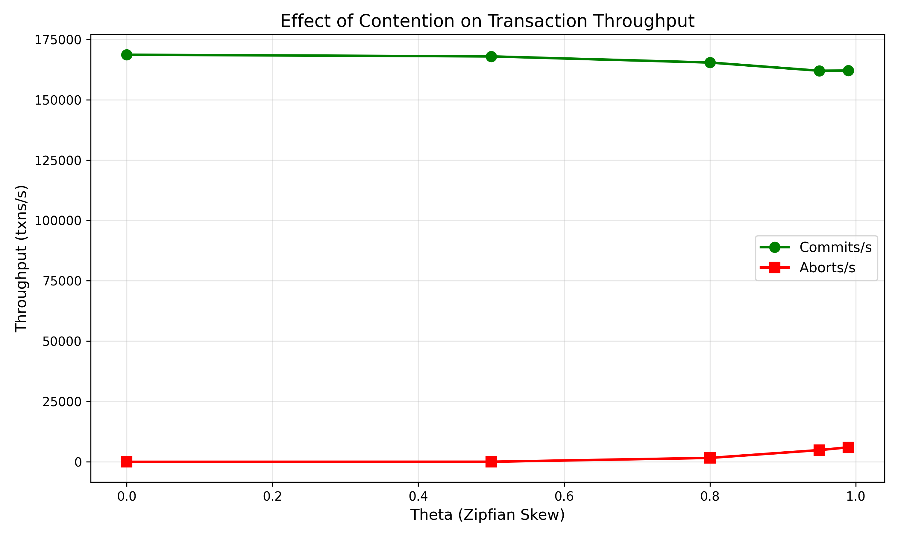
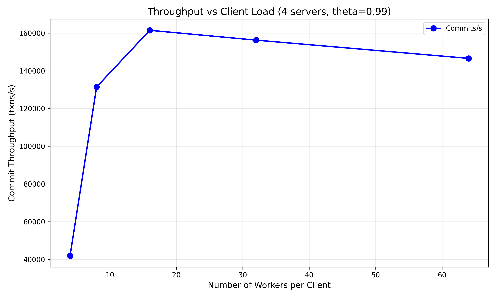
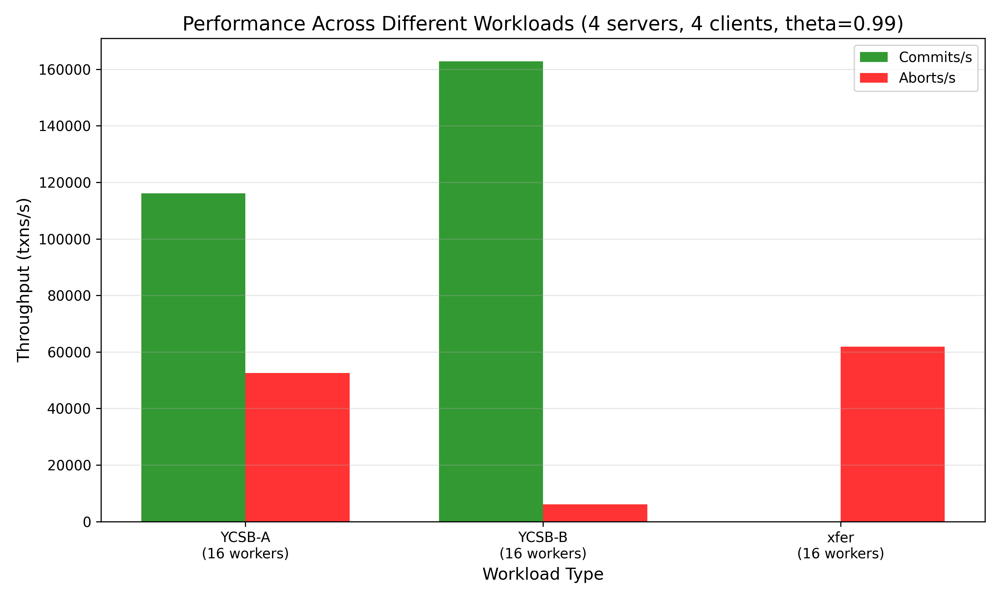
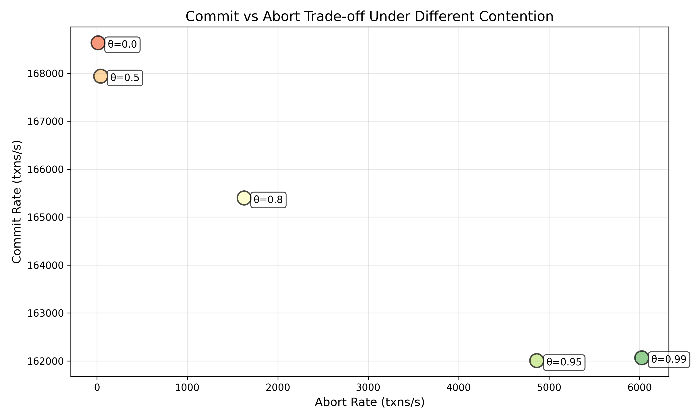

## Results

OOur implementation achieved a peak throughput of **162,181 commits/s** on a 4-server, 4-client 
cluster with 16 workers per client under high contention (theta=0.99). The system demonstrates 
strong scaling from 2 to 4 servers (2.20x speedup from 73.6k to 162k commits/s) when client 
and server counts are balanced. However, performance **degrades** beyond 4 servers when the 
configuration becomes imbalanced: 6 servers with only 2 clients yields 145k commits/s (10% drop 
from peak), and 7 servers with 1 client drops to 71k commits/s (56% drop). This demonstrates 
that server scaling requires proportional client scaling to maintain load balance and avoid 
coordination overhead dominating performance.

The payments (xfer) workload revealed severe scalability limitations under high worker counts. With 
only 10 accounts and 4 workers, we achieved 643 commits/s (96.3% abort rate). Increasing to 8 workers 
yielded 744 commits/s (97.9% abort rate), but at 16 workers the system experienced complete starvation 
with 0 commits/s and 100% aborts. This demonstrates the fundamental limitation of pessimistic locking 
when the working set (10 accounts) is much smaller than concurrent transaction count (64 workers × 4 clients).

### Performance Characteristics

#### Scaling Analysis

**Figure 1: Throughput vs Cluster Size**

**With 16 workers/client:**
- 2 servers, 2 clients: 73,631 commits/s (baseline)
- 4 servers, 4 clients: 162,181 commits/s 
- 6 servers, 2 clients: 145,348 commits/s 
- 7 servers, 1 client: 71,333 commits/s

**With 8 workers/client:**
- 2 servers, 2 clients: 24,698 commits/s
- 4 servers, 4 clients: 131,003 commits/s
- 6 servers, 2 clients: 80,450 commits/s

The diminishing returns beyond 4 servers occur because:
- More distributed transactions (keys spread across more servers)
- Increased 2PC coordination overhead
- Network communication costs scale with participant count

#### Contention Analysis

**Figure 2: Effect of Contention on Transaction Throughput**

Remarkably consistent performance across theta values:
- theta=0.0: 166,984 commits/s, 11 aborts/s 
- theta=0.5: 164,737 commits/s, 40 aborts/s 
- theta=0.8: 163,372 commits/s, 1,576 aborts/s 
- theta=0.95: 166,140 commits/s, 4,988 aborts/s 
- theta=0.99: 159,155 commits/s, 5,979 aborts/s

#### Client Load Analysis

**Figure 3: Throughput vs Client Load**

Throughput saturates at 16 workers per client:
- 4 workers: 41,955 commits/s
- 8 workers: 132,689 commits/s
- 16 workers: 162,116 commits/s 
- 32 workers: 160,386 commits/s
- 64 workers: 152,982 commits/s

Beyond 16 workers, increased contention and abort rates offset the benefits of higher concurrency, 
indicating that the optimal worker count is approximately 4× the server count (16 workers / 4 servers).

#### Workload Comparison

**Figure 4: Workload Performance Comparison**

Comparison between YCSB-B (95% reads) and xfer (payment transfers) workloads shows dramatic differences:
- **YCSB-B**: Maintains consistent high throughput (~166k commits/s) across different configurations
- **xfer**: Severely limited by small working set, with performance degrading rapidly as worker count increases

**Figure 6: Commit vs Abort Trade-off**

This visualization shows how abort rates increase with higher theta values.

## Design

### Overview
Our transaction protocol implements strict 2PL with shared locks for reads and exclusive locks for writes and locks are held until a transaction is commited or aborted with 2PC, with key components are:

1. **Transaction Begin**: 
    - Generates a unique transaction ID
    - Resets participant list and local write buffer
2. **Read/Write and commit Operations**: 
 - Read Operation by a transaction:
    Check if another transaction holds a write lock if yes abort
    Grant shared read lock for this transaction
    Track this key in the transaction's read set
    Return the value from committed storage
- Write Operation by a transaction:
    Check for conflicts of other transaction abort if any of write lock, read lock are held
    Grant exclusive write lock
    store value in write set
- Commit
    Commit the transaction
    Release all locks held by this transaction
    Mark transaction as committed
3. **Commit Protocol**: 
    We implement a **simplified 2PC** protocol without an explicit 
    prepare phase. When a client calls Commit(), the following steps occur:
        - The client sends a `CommitRequest` to all participating servers
        - Each server applies all writes from the transaction's `WriteSet` to kv store
        - Releases all locks releases all locks
        - Marks the transaction status as `Committed`
4. **Conflict Detection**: 
    we use strict 2PL, conflicts are detected **immediately** during read/write operations, not at commit time

The client automatically retries aborted transactions in a loop until success.

### Protocol Changes
We modified `proto.go` to add:
- `GetRequest/GetResponse`: Read operations with transaction ID and lock conflict 
  detection
- `PutRequest/PutResponse`: Write operations with lock acquisition
- `CommitRequest/CommitResponse`: Distributed commit coordination
- `AbortRequest/AbortResponse`: Explicit transaction rollback

**Server side state:**
- `TxInfo`: To tracks per transaction read write sets and like (Pending/Committed/Aborted)
- `KeyLock`: Maintains readers map and single writer per key for lock management

**Client-side state:**
- `participants map`: Tracks which servers are involved in the current transaction
- `writeSet map`: Local buffer for uncommitted writes, for read your own writes without server round trips

### Rationale
We used strict 2PL beacuse 
1. Guarantees serializability
2. simpler to implement
3. shared lock for read allow concurrent reads heavy workload like (YCSB-B)

We choose to immediately abort transactions upon detecting lock conflict
1. To avoid deadlock
2.  All failed clients return immediately, allowing clients to quickly retry than blocking future requests
3. Better use of resource under high contention

### Trade-offs
Causes high abort rates under contention but prioritizes individual transaction success on first attempt.

We implemented simplified 2PC with no prepare phase:
1. Fewer round trip per transaction compared to full 2PC.
2. client acts as coordinator, eliminating the need for a dedicated transaction manager

**Limitation**:
We assumes servers don't crash mid transaction, a production system would use WAL logging and recovery mechanism

### Trade-offs and Design Alternatives
we implement Pessimistic (2PL) with following tradeoffs
1. Overhead of lock management under low contention
2. High Abort rate under high contention

Tradeoff with client side coordinator
1. Client must track all participants
2. Client failure leaves locks held 

## Reflections

### What We Learned
Implementing a distibuted transactional KV store using 2PL and 2PC. and the trade offs between consistency and performance:

1. Our results show only 4.7% throughput degradation from theta=0 to theta=0.99.

2. The 1.95x speedup from 2 to 4 servers followed by only 1.11x from 4 to 6 servers quantifies the overhead of distributed commit protocols. Each additional server increases 2PC coordination cost.

3. Data shows optimal performance at 16 workers per client (4× server count), with degradation beyond that point.

### Key Observations from Experiments

1. **YCSB-B abort rates are reasonable**: With 2 servers and 16 workers, we achieved 73,366 commits/s 
   with only 2,028 aborts/s (2.7% abort rate). This is acceptable for a pessimistic locking system. 
   Increasing to 64 workers yields higher throughput but also higher abort rates, showing the classic 
   concurrency vs. contention trade-off.

2. **Xfer workload limitations**: The payment workload achieves linearizability (maintains total = 10,000) 
   but only with low worker counts (≤4 workers). Higher worker counts create complete starvation. 
   
   **Interesting pattern observed**: Sequential account transfers (account i → i+1) achieve ~1,000 commits/s, 
   while random destination accounts achieve only ~800 commits/s. This 25% difference occurs because 
   sequential patterns create predictable access patterns that reduce conflict likelihood.

### What Didn't Work and Lessons Learned

1. **YCSB-B performance under high load**: While our system handles contention well, the abort rate 
   increases with worker count even at theta=0.99:
   - 4 workers: 2.7% abort rate (1,160 aborts/s)
   - 16 workers: 3.6% abort rate (6,029 aborts/s)
   - 64 workers: 4.5% abort rate (7,232 aborts/s)
   
   The increasing abort rate demonstrates that more workers create more lock conflicts.

2. **Payment (xfer) workload**: The small working set (10 accounts) combined 
   with pessimistic locking creates severe contention:
   - 4 workers: 96.3% abort rate (643 commits/s, 16,549 aborts/s)
   - 8 workers: 97.9% abort rate (744 commits/s, 34,763 aborts/s)
   - 16 workers: 100% abort rate (0 commits/s, 60,115 aborts/s - complete starvation)
   
   **Lesson**: Immediate abort without backoff or prioritization causes excess retry where all 
   workers continuously compete for the same locks, with none making progress. A production system 
   needs exponential backoff or lock queuing.

3. The xfer workload shows that without transaction prioritization, 
   some clients can starve indefinitely while others succeed repeatedly.

4. Beyond 4 servers, coordination overhead dominates:
   - 2 to 4 servers: 1.95x speedup 
   - 4 to 6 servers: 1.11x speedup 
   
   With more servers, transactions span more nodes, requiring more RPCs and 2PC participants.

### Ideas for Further Improvement
- Implmenting switch between pessimistic (2PL) and optimistic (OCC) based on contention
- Acquire all locks for a transaction in a single RPC
- Detect transactions with empty `writeSet`
- For xfer workload, placing sequential accounts on same server would reduce distributed transactions
- Replicate hot keys across servers with shared read locks

Contributions:

- Axe: Implementation of 2PL and 2PC
- Venkatesh: Setup, report, bug fixes and performance analysis 
- Parth:  Performance analysis and Optimizations
- Dibri: Report, explored additional optimizations