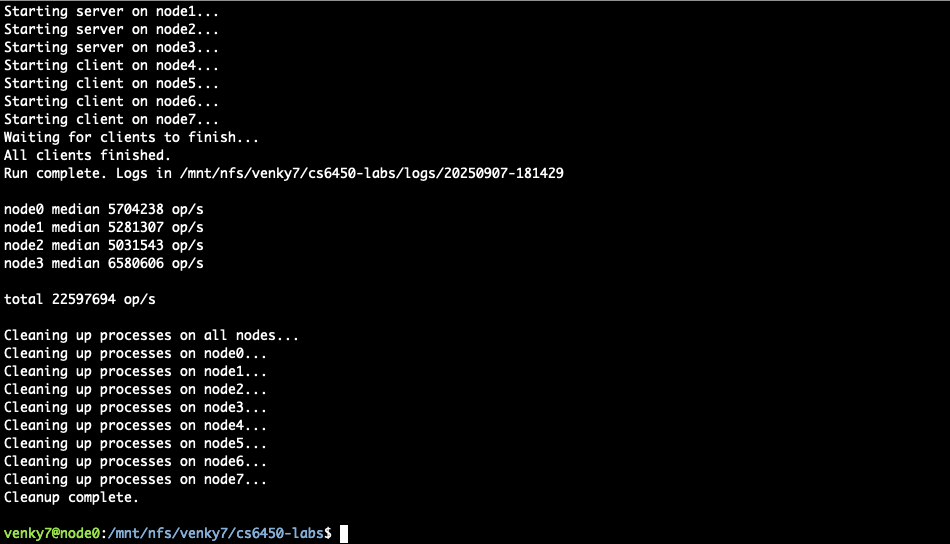

## Results

1. Our optimized kv store is able to complete 22M op/s on 8 m510 machines, almost 500x above our baseline of 45234.
2. We are able to maximize use of our hardware:
    - We use up to 2.9 GBs of memory on one of the server node, when running at maximum number of nodes with 64 workers and batch_size of 10000.
    - The network usage peaked around 4.35 GB/s between client and server.
    - Running `htop` on one of our client nodes highlights that we used roughly 68% of compute on each of the available 16 cores while running in dev mode (4 cloudlab nodes).
3. 1 node = 6458430 op/s, 2 nodes = 12289743 op/s, 4 nodes = 22531773 op/s. We can see the performance scales roughly linearly.

*KV store throughput*

*System resource usage on client when using maximum number of nodes*

*System resource usage on server when using maximum number of nodes*

*Bandwidth Consumption between Client and server*

## Design

The most important design change we made is to get rid of the mutex, since it is not an low-level, atomic primitive. Instead, we used sync.Map, which is "thread safe for concurrent use by multiple goroutines without additional locking or coordination." This way we can greatly reduce the contention caused by multiple goroutines acquiring mutex.

On the client side, we also use async RPC calls to send request insted of previous blocking calls, This frees our CPU to do other tasks. Another change we made was running multiple goroutines per client to send requests to server to fully utilize availabe CPU cores.

We added 2 knobs to get better throughput :
1. Workers : Number of goroutines for run from each client node.
2. Batch Size: Number of operation to send to the server in one trip

Another design change we made is batching the requests and responses. This way we can greatly reduce the overhead of creating goroutines. One thing worth pointing out is that we used an atomic counter (by using atomic.Uint64) for fast and safe request number tracking which was used as a timestamp to maintain order the operations that are then sorted on server to maintain real time odering, hence providing linearizability.

Lastly, we shard the kvs to allow each server only serve parts of the kvs, which also reduces the contention.

All of these methods combined provides fast and linearizable semantics for the distributed kvs. The usage of sync.Map and sharding guarantees all the requests will be visible in some total order. And the atomic counter will ensure all requests from one client will respect real-time ordering.

## Reproduce The Results

Make sure you can write to the ./log directory.
Make sure go appears in your PATH.

1. Reserve 8 m510 machines on CloudLab using the small-lan profile with Ubuntu 24.04 as an image of choice.
2. Run setup in 1 node of choice: `ssh -A [CL-HOST-ADDR] && /proj/utah-cs6450-PG0/bin/setup-nfs && /proj/utah-cs6450-PG0/bin/install-go`
3. Enter the nfs directory `/mnt/nfs/`
4. Clone repo: `git clone https://github.com/venkateshdb/cs6450-labs.git  && cd cs6450-labs && git checkout pa1-turnin`
5. Run: `./run-cluster.sh 4 4 "" "-workers 64 -batch_size 10000"` or `./run-cluster.sh` (you can vary number of workers and batch_size)

## Reflections

The request batching worked surprisingly well for optimization. We were not expecting the overhead of creating goroutines are that high. And after implementing sharding, getting rid of the mutex, and batching the requests, the performance of the kvs is very good.
For future improvements, we can probably do multiple shards on one server node, which should also increase the performance. We can also use gRPC to further optimize network performance as its a binary protocal it can reduced network packet size and do connection multiplexing which can help get better performace.

Contributions:

- Venkatesh: Github Setup and Optimizations(sharding, getting rid of locks on server)
- Axe: Report & performance analysis
- Parth:  performance analysis and Optimizations(multiple goroutines, Async RPC calls).
- Dibri: Report, performance analysis, and explored additional optimizations.
